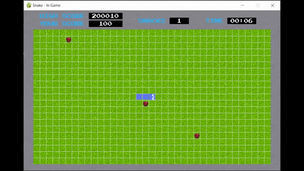
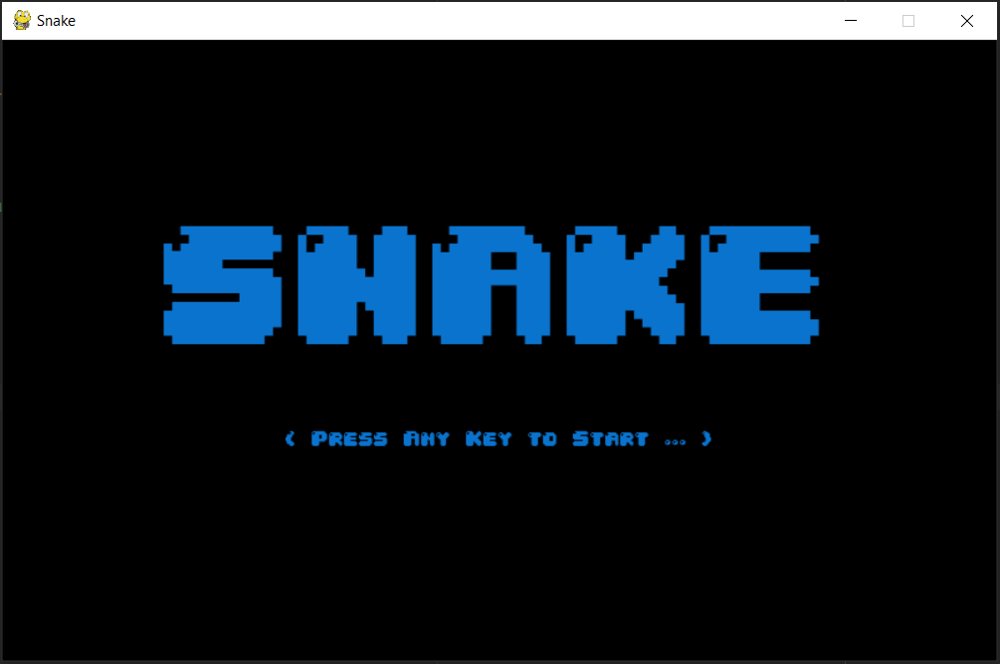
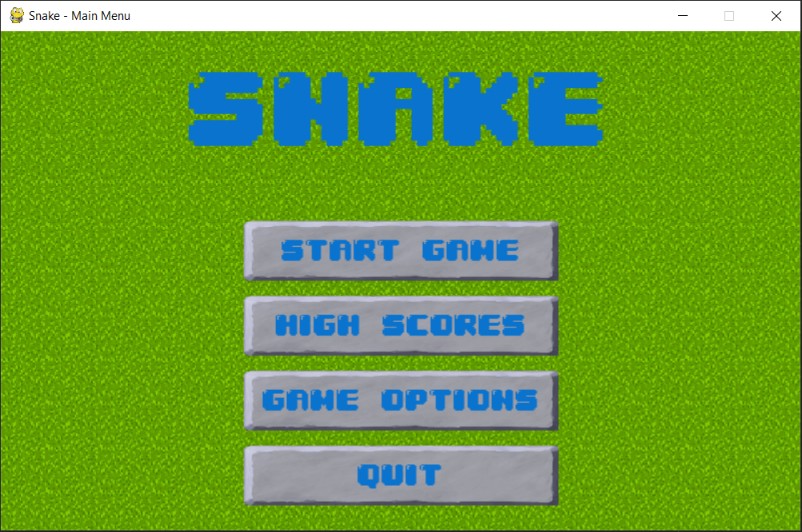
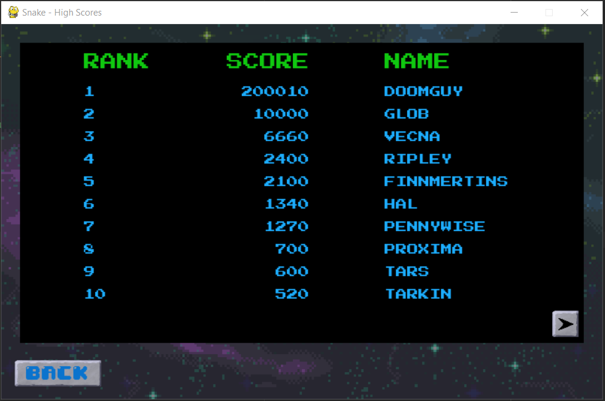
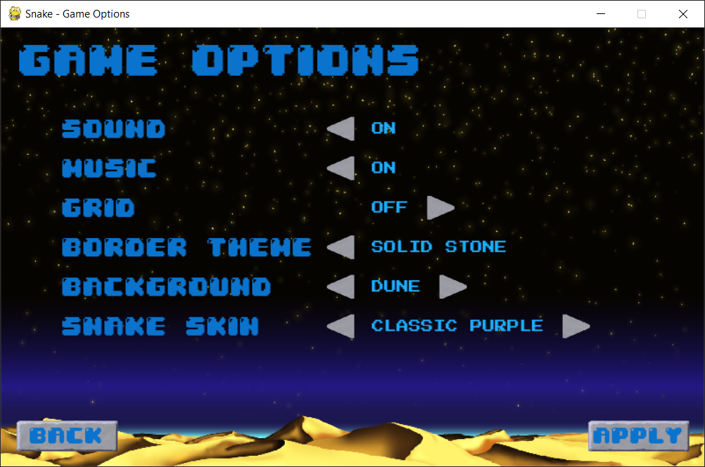
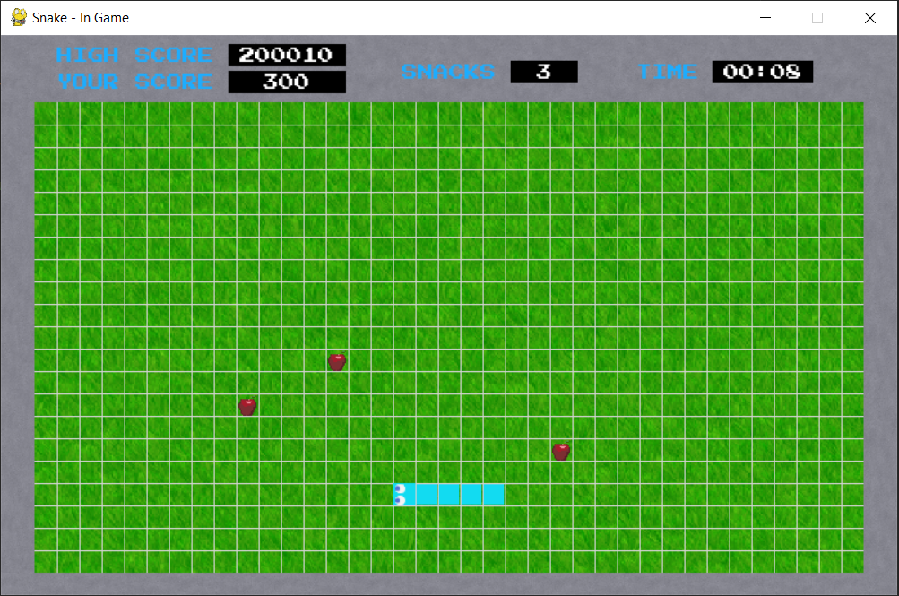
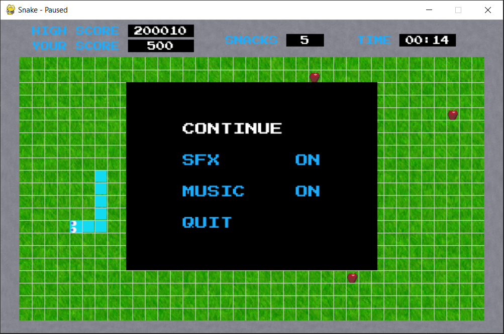
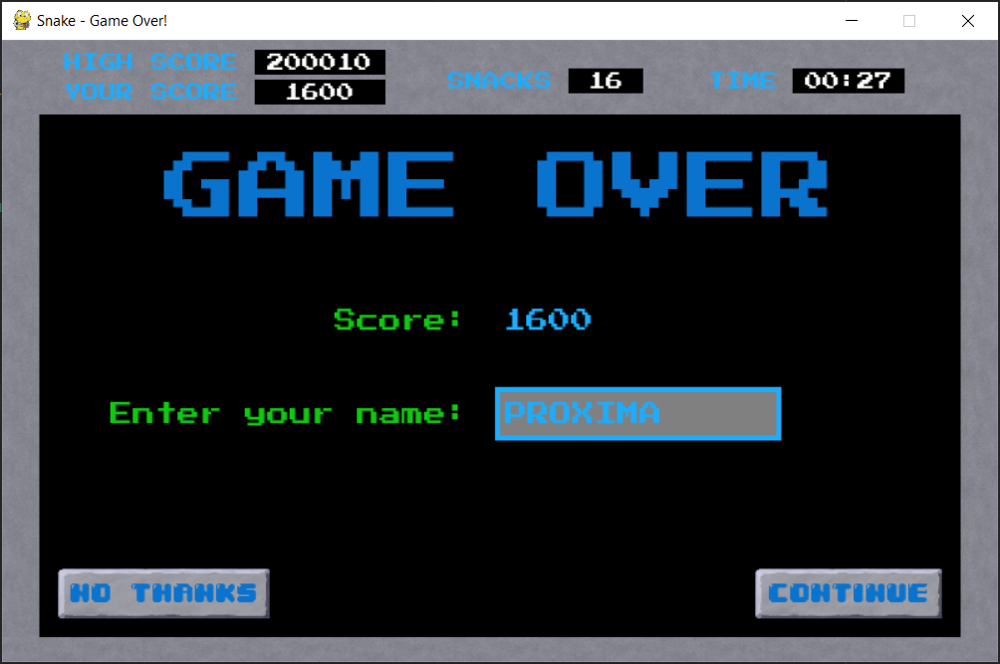
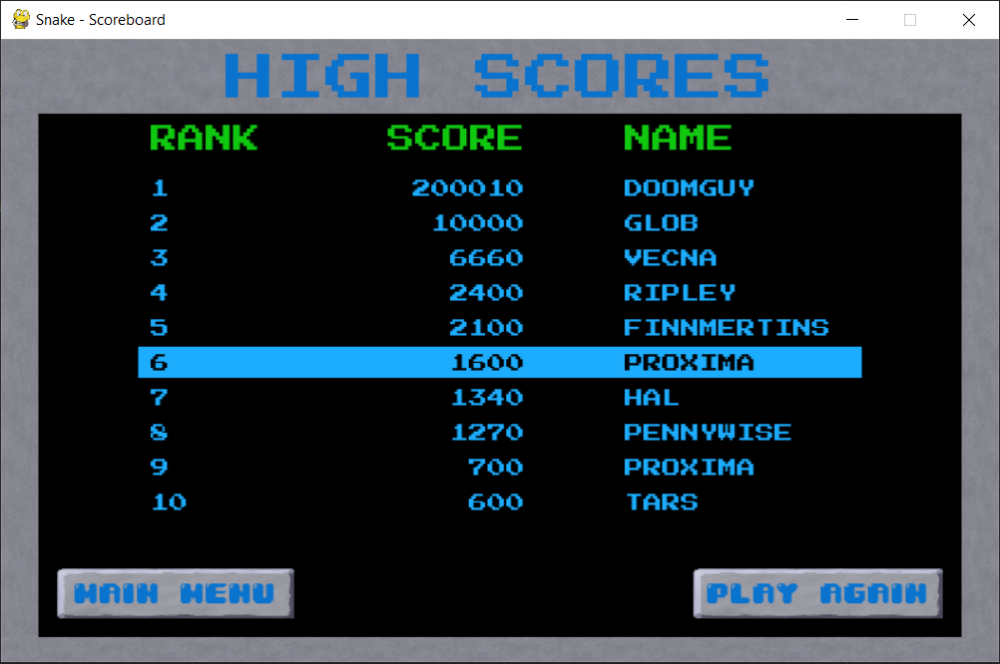
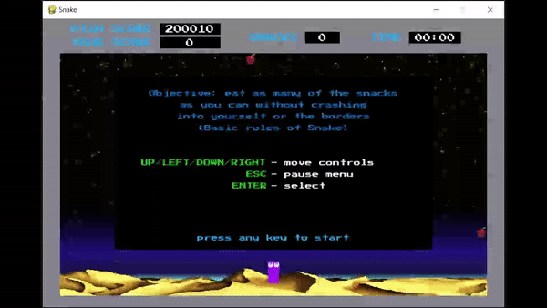

<h1 align='center'>Snake Game</h1>

<h2>Description:</h2>

An over-engineered customized clone of the classic snake game.

<h3>Features included:</h3>

- Multiple screens (splash screen, main menu, high scores screen, game options screen, snake game screen, pause menu, 
game over screen, and post game screen)

  
   
  
  

  
   
  
  

- Menu/game music and sfx
- Custom made reusable responsive buttons and text input boxes
- Dynamic and organized high scores screen/board
- Dynamic game settings screen w/ options utilizing various game assets (note: asset source/credit information can be 
found in its folder's asset_sources.txt doc, present in each folder of the project_assets directory.)
- Full-fledged snake game with border ui, pregame rules board, and pause menu

- Game over screen with option to save score
- Post game screen with option to return to main menu or play again

<h3>Game Demo:</h3>

")

<h2>Goals/purposes:</h2>

- Get more experience learning frameworks.
- Learn how to use Pygame.
- Create a game that actually has a gui.
- Practice resourcefulness/learning "on the fly" (determine and find required information in order to implement a 
feature instead of using videos and/or going through an entire online course before actually creating something).
- Practice using pep8 and improving the structure of my code
- Learn about event handling.
- Practice using/creating modules/packages in python.
- Practice using classes and all their features to gain a better understanding of OOP and why you'd want to use it in 
the first place (one of the main purposes of this project).
- Exercise the practice of making readme files.
- Learn how to use file I/O reading/writing.
- Learn how to use adobe xd to make mockups.
- Learn about licensing and how to find and use external assets.
- Learn how to modify and create assets in adobe photoshop and illustrator.
- Exercise the practice of refactoring code.
- Practice using type annotations.
- Learn about docstring formats.
- Use inline comments.
- Use inline conditionals.
- Use list comprehensions.
- Learn about and use map/filter and lambda expressions.
- Gain understanding of positional and keyword arguments.
- Get better at planning and organizing projects via txt outlines and scrum (see note below).
- Practice using git/github (honestly should've connected this project to a repo from the very beginning instead of 
after it was finished; silver lining: I definitely understand how useful and necessary version control software is now).

<h3>Note:</h3>

- The project folder named "project_plans_scrum_files" holds "bricks_in_the_wall.txt". It started out as a file used 
for breaking down abstract features into implementation steps and to also keep track of difficult challenges that I 
overcame throughout my project, so that I could encourage myself to persist. The file, "features.txt" was made to keep 
track of features that I wanted to eventually implement. Both of these files, however, slowly morphed into what I 
realized was a kind of scrum board. The line under the WIP section that says "_wip-loc_", is just a way to indicate to 
myself where the current task "location" was. (Also, the "algorithms.txt" file was supposed to be used to create 
algorithms and sample runs for features that I wanted to implement, but I ended up just using my notebook and 
"bricks_in_the_wall.txt" to create my project's solutions/algorithms. As a result, "algorithms.txt" never really 
advanced into something more coherent).
